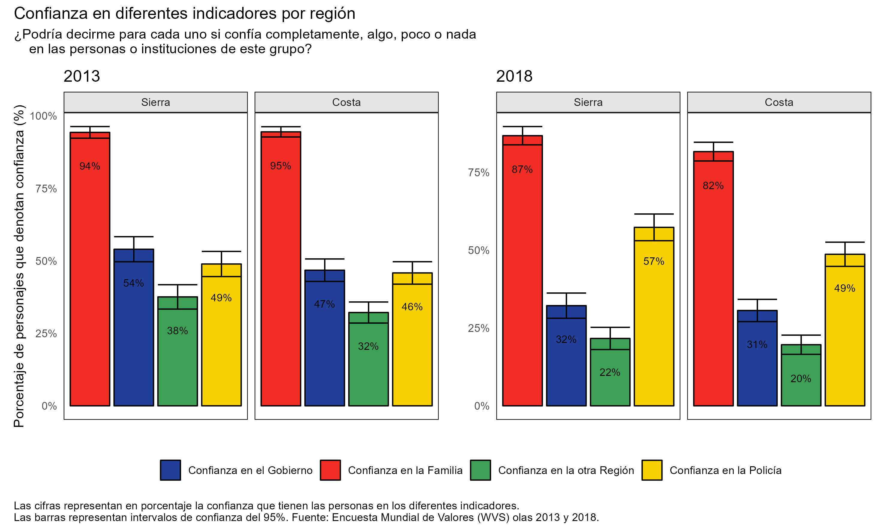
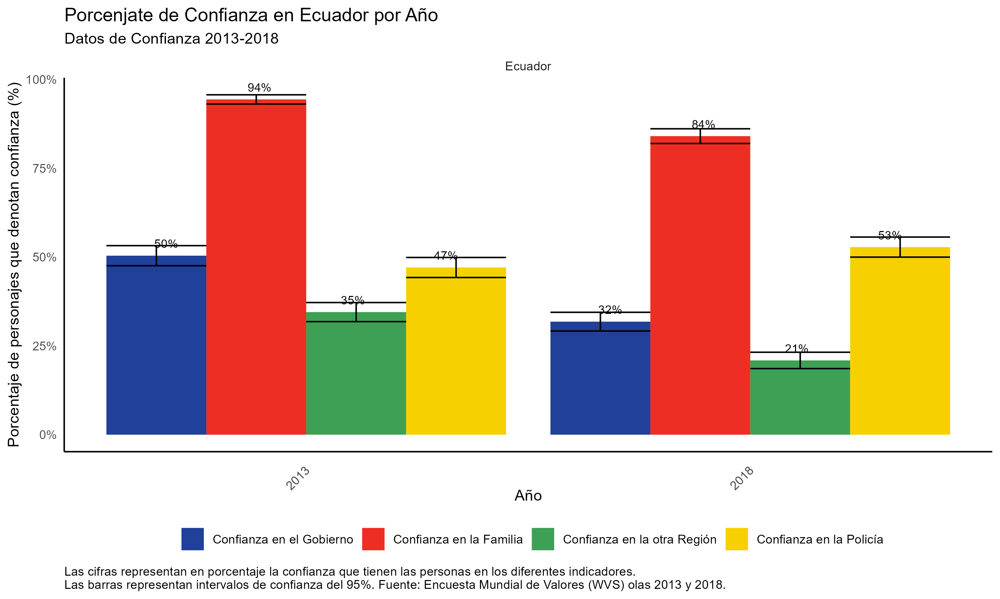

```{r setup, include=FALSE}
knitr::opts_chunk$set(echo = F) 
```

El nivel de confianza que existe dentro de una sociedad funciona como un indicador de cómo se desarrollará la misma [@keefer_confianza_2022-1]. Las consecuencias económicas y políticas de un bajo nivel de confianza se reflejan en múltiples niveles sociales, reduciendo el crecimiento económico y la innovación. Por otro lado, un nivel alto de confianza da como resultado un mejor funcionamiento de la sociedad, donde los trabajadores, empleadores, bancos, empresas y gobierno confían el uno en el otro con el fin de generar crecimiento económico. 

Se identifican tres vías específicas a partir de las cuales el nivel de confianza puede distorsionar las actividades económicas. La primera es entre el gobierno y las empresas. Los gobiernos promueven la actividad económica a través de conjuntos de políticas regulatorias y fiscales; si existe desconfianza, las empresas serán menos propensas a aprovechar esas condiciones favorables, puesto que desconfían de las políticas del gobierno. La segunda vía es la confianza interpersonal de los ciudadanos, que afecta particularmente a las regulaciones públicas hacia las empresas. Si los individuos no confían en las empresas, estos buscarán que exista un mayor número de regulaciones hacia las mismas, lo que crea cargas adicionales para las mismas. La última vía es la desconfianza interpersonal, a la manera en que las empresas interactúan internamente y hacen negocios unas con otras. Esto quiere decir que la desconfianza interpersonal disuade a las empresas a contratar o delegar responsabilidad a los mejores trabajadores, lo cual provoca que las mismas no sean eficientes o demoren más al momento de tomar una decisión.  En este artículo, estudiamos la confianza de forma cuantitativa, utilizando los indicadores recogidos por la Encuesta Mundial de Valores (WVS). Esta encuesta se realiza en diversos países del mundo, incluyendo al Ecuador en 2013 y 2018. 

# ¿Quién confía más, Sierra o Costa?   

```{r}

```
Hoy en día ninguna región en el Ecuador se encuentra exenta de los problemas actuales que vive el país. Sin embargo, el impacto parece ser mucho más notorio en unas regiones que en otras. El gráfico de arriba muestra varios indicadores de confianza medidos por la WVS entre 2013 y 2018, separados por las dos regiones principales del Ecuador, Costa y Sierra. 

Como se puede observar, en la región Costa, el porcentaje de personas que confían en diversas instituciones sociales es menor a la Sierra, para todos los indicadores, salvo para la confianza en la familia, en donde la diferencia es mínima. Notablemente, en el contexto de la gran rivalidad que existe entre estas regiones del país, misma que se puede entender a través de la siguiente cita“La rivalidad es sobre todo política y económica. Los costeños siempre sintieron que el dinero que se generaba en su ciudad, principalmente por el puerto, se gastaba en los sueldos de los burócratas en Quito y en proyectos que benefician a la región montañosa.”[@noauthor_serranos_2015], se puede notar que tanto en 2018 como en 2013, la Costa demostraba menor confianza en la sierra. 

¿A qué se deben estas diferencias? En la región costera del Ecuador es donde también hoy ocurren la mayoría de crímenes y agresiones de la reciente ola de violencia que el Ecuador enfrenta para el año 2018 el 65% de los asesinatos intencionales totales en Ecuador ocurrieron en esta región y el 47% se dieron en tres provincias de la costa las cuales son Guayas, Manabí y Los Ríos[@oeco-padf_tasa_2023]. A su vez, en esta región es donde el SRI registra un mayor número de cierre de RUC, donde podemos ver que se dio un aumento del 270% en el número de cierres de catastros del año 2017 al año 2018, que son un reflejo sobre la cantidad de negocios activos que se encuentran en dicha región[@censos_enemdu_nodate [@censos_instituto_nodate]. Todos estos factores pueden empeorar la forma en la que las personas confían. Ahora bien, el efecto de esto en la confianza en la Sierra no es claro. Es posible que la percepción de un gobierno central inadecuado (puesto que el gobierno se suele relacionar a la Sierra) podría haber llevado a la Costa a desconfiar de la Sierra. 

El cambio en el tiempo de los indicadores de confianza es obvio, para ambas regiones del país. Todos los indicadores demuestran un claro deterioro, mostrando el incremento de la desconfianza en nuestro país. Es imperativo observar los indicadores en agregado, e investigar su evolución y los posibles factores de influencia. 

# La reducción de la confianza en el Ecuador en el tiempo

```{r}

```

Como se ha mencionado anteriormente, el deterioro de la confianza a nivel regional de 2013 a 2018 es evidente, y esto se puede observar en el gráfico de arriba, que muestra los indicadores de confianza a nivel nacional. En el agregado, encontramos la misma tendencia, con la única excepción de la confianza en la policía, que aumenta notablemente. Podemos observar que en 2018 tan solo el 32% de los ecuatorianos confían en el gobierno, lo cual es una reducción de casi 20 puntos porcentuales respecto a 2013. 

¿Qué cambió entre 2013 y 2018? El más obvio factor sería el económico. La situación económica actual del Ecuador es alarmante. Esta puede verse reflejada en el constante aumento del desempleo y subempleo, así como en la reducción de la inversión extranjera directa. En el año 2013, esta fue de 727 millones de dólares, representando un 0.8% del PIB del Ecuador; sin embargo, esta se redujo en un 13%[@noauthor_inversion_2022] para el año 2018 [@noauthor_resultados_2019]. A su vez, si comparamos el PIB del Ecuador del último trimestre de 2017 con el del último trimestre de 2018, podemos ver que este apenas aumentó en 0.8%[@noauthor_resultados_2019].

Uno de los indicadores claves que establece el Banco Interamericano de Desarrollo (BID) para explicar esta situación es la confianza. Ecuador ocupa uno de los últimos puestos en Latinoamérica en cuanto a este índice, donde tan solo el 10 % de las personas confían en los demás [@keefer_confianza_2022].

Otra posible explicación para una reducción tan drástica sobre esta variable es que, en el año 2017, cuando terminó el mandato de Rafael Correa, se tuvo un importante aumento de acusaciones de corrupción[@noauthor_2017_2017] . Dichas acusaciones pueden haber causado que dos tercios de los ecuatorianos pierdan su confianza en el gobierno de Rafael Correa y no estén de acuerdo con la forma de actuar del mismo[@quillupangui_58_1] . La desconfianza es una forma de protección que tienen los ciudadanos en contra de las malas acciones del sistema político y sus representantes. Existen varias acciones las cuales pueden generar desconfianza  en los ciudadanos y una de las principales es la corrupción y falta de transparencia, lo cual se pudo evidenciar durante este periodo de tiempo[@gomez_mancilla_desconfianza_2015]. 

La única confianza que aumentó es hacia la policía. Esto se podría deber al incremento indiscriminado de la violencia y crímenes en el país, lo cual no deja a los ciudadanos otra alternativa más que confiar en las fuerzas del orden. Hay un aumento pequeño en la confianza en la policía, sin embargo, esto deja mucho que decir sobre la percepción de las personas sobre esta institución, dado que el 47% de los ecuatorianos no confían en la policía.  

# La relación entre la economía y la confianza 

El hecho de que exista un nivel de confianza bajo en el Ecuador se ve reflejado directamente en la economía. Un sector de la economía del Ecuador que refleja directamente las consecuencias de una falta de confianza es el mercado laboral. Al existir una falta de confianza, sobre todo en el gobierno, tanto los ciudadanos como las empresas podrían ser más reticentes a obedecer las leyes, como el pago de impuestos o seguir las regulaciones laborales. Esto genera directamente un aumento en la informalidad en la economía.

Al no existir confianza, las firmas ecuatorianas pueden dejar seguir las regulaciones establecidas, lo cual podría haber causado que la población ocupada para el año 2018 en el sector informal sea del 46.2%% del total del mercado laboral ecuatoriano, lo cual es mayor a lo que se registró en 2017 y solo se espera que siga creciendo[@noauthor_en_nodate].

```{r}
knitr::include_graphics("figures/gráfico_miedo_perder_empleo.png")
```
En el gráfico arriba, podemos ver un claro ejemplo de lo que podría significar la desconfianza dentro del mercado laboral. En 2018, el 80% de los ecuatorianos, sin importar su región, tienen una gran preocupación sobre perder su trabajo o no encontrar empleo. 

Esto genera grandes repercusiones en otros sectores de la economía, como el mercado de crédito o bienes de consumo, donde en el primer trimestre de 2023 se registró una disminución del 2% del gasto de consumo final de los hogares[@noauthor_informacion_nodate] . Debido a la situación de incertidumbre actual, los ciudadanos están impulsados a reducir sus gastos, causando que se reduzca el tamaño de la economía ecuatoriana. Esto solo es una prueba más del crecimiento del sector informal del empleo. La desconfianza podría causar que no se dinamice la economía, llevándola a una situación de estancamiento como la que se vive actualmente en Ecuador.

# Conclusión

El porcentaje de personas que confían en las diferentes instituciones funciona como un indicador de cómo se desarrollará dicho país. La desconfianza por parte de algunos individuos siempre va a existir, sin embargo, el problema se genera cuando muchos ciudadanos del mismo país presentan desconfianza en las diferentes instituciones públicas. En el caso de Ecuador, podemos ver que más de la mitad de los ciudadanos no confían en su gobierno. Esta desconfianza se ve reflejada tanto a nivel social como económico. De esta manera, la desconfianza en el gobierno genera que exista menor inversión en el país y que las empresas, al no tener confianza en el gobierno, puedan en algunos casos negarse a pagar impuestos y respetar algunas leyes.

El impacto de la desconfianza también se vive a nivel individual, donde 80% ecuatorianos hoy en día tienen miedo a perder su empleo o no encontrar trabajo y más de la mitad de la población empleada se encuentre en la zona de empleo informal. Otro impacto económico es la reducción del consumo por parte de los hogares, lo cual nos muestra una desaceleración de la economía ecuatoriana. Por último, podemos ver que los porcentajes de confianza varían entre regiones en el Ecuador y esto se debe a que la región Costa ha sido mucho más golpeada por la ola de violencia que está viviendo nuestro país.

# Referencias
